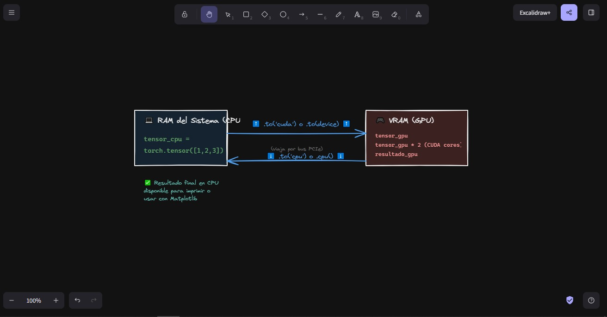
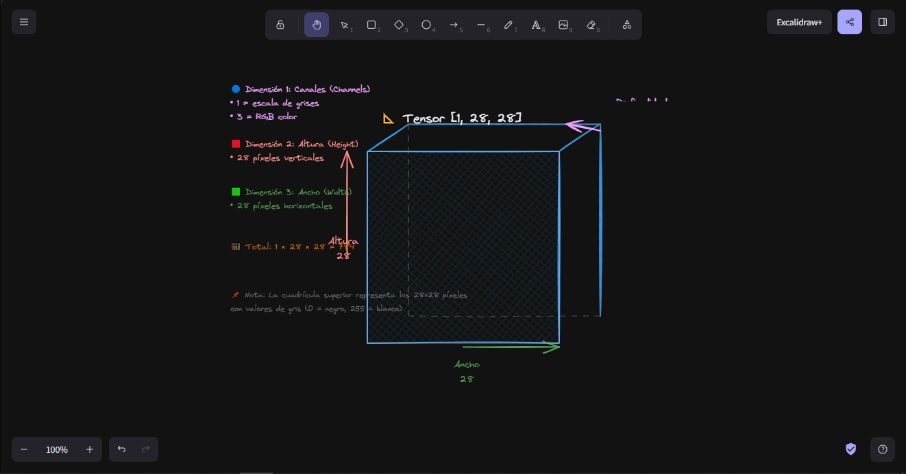
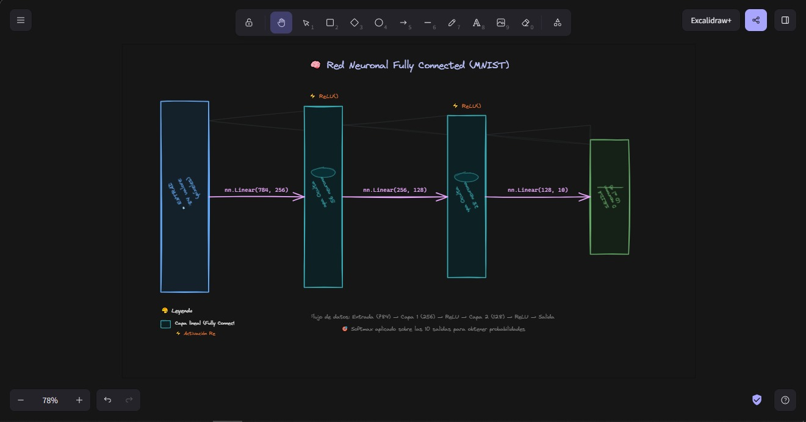
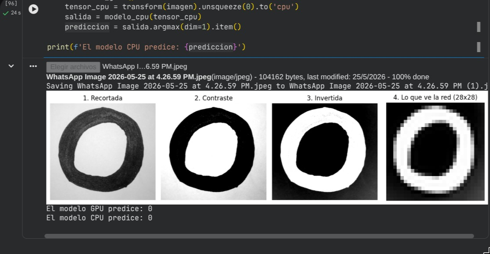
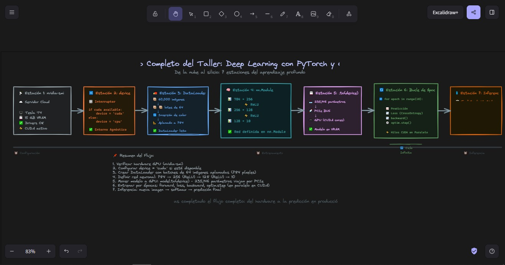

# Entrenamiento de Redes Neuronales en GPU

- CUDA con PyTorch en Google Colab

---


|                 |                                                 |
| --------------- | ----------------------------------------------- |
| **Parcial**     | Segundo Corte                                   |
| **Materia**     | Programación Paralela y Computación Distribuida |
| **Profesor**    | Alejandro Jaimes Carrillo                       |
| **Integrantes** | Ruben Cifuentes y Santiago Villzamizar          |
|                 |                                                 |
| **Fecha**       | 25/05/26                                        |


---

## 0. Instrucciones Generales

- El taller se desarrolla en Google Colab usando una GPU gratuita de NVIDIA.
- Se trabaja en parejas; ambos integrantes deben entender cada parte.
- Se deben capturar pantallazos de cada salida importante indicada con [PANTALLAZO].
- Al finalizar, se descarga el notebook y se sube todo a un repositorio de GitHub.

### Preguntas

1. ¿Qué diferencia hay entre un notebook en la nube (Colab) y un entorno local como el del tutorial de instalación? ¿Cuál prefieren y por qué?
  Las diferencias iniciales son de instalacion, una ventaja de hacerlo en colab es que te ahorras toda esa parte mientras que en local debes hacer todo el proceso
    ademas de que depende de si tengas una grafica de nvidia, en un tema de costos, si lo haces en colab no necesitas hacer la inversion de adquirir un equipo que 
    tenga una grafica, el almacenamiento en colab es temporal, si llegas a cerrar sesion pierdes tus archivos no guardados en drive, en local todo es permanente ya 
    que se guarda en el disco duro. Por ultimo un tema muy importante y que los diferencia es la privacidad, en colab tus archivos quedan subidos en una nube, en 
    local la privacidad es total.
    En nuestro caso preferimos el colab por un tema de equipos, no tenemos graficos NVIDIA asi que colab es nuestra mejor alternativa y solucion.
2. Antes de comenzar, hagan una predicción: ¿cuántas veces más rápida creen que será la GPU comparada con la CPU en el entrenamiento? Anoten su predicción aquí y compárenla al final con el resultado real.
  En nuestra prediccion creemos que la GPU sera 3 veces mas rapida que la CPU.

---

## 1. Configurar el Entorno en Google Colab

- Activar la GPU desde el menú de Colab: Entorno de ejecución > Cambiar tipo de entorno de ejecución.
- Verificar que PyTorch reconoce la GPU y mostrar el nombre del dispositivo.
- Ejecutar `nvidia-smi` para ver el estado de la GPU, igual que en el tutorial de instalación.

### Preguntas

1. La salida de `nvidia-smi` muestra campos como *Driver Version*, *Memory Usage* y *GPU-Util*. ¿Qué indica cada uno?
  Driver Version (Versión del Controlador): Es la versión del software ("driver") instalado en el sistema operativo. Funciona como el traductor o puente de       comunicación entre el sistema operativo y el hardware físico de la GPU. En tu caso, es la versión 580.82.07.
    Memory Usage (Uso de Memoria VRAM): Te indica cuánta memoria de video está ocupada en ese instante preciso. Tu captura muestra 3MiB / 15360MiB. Significa que tienes 15 GB de memoria total (VRAM) y solo estás usando 3 MB; es decir, está completamente libre y lista para recibir tus tensores o modelos pesados.
    GPU-Util (Utilización de la GPU): Mide el porcentaje de tiempo en el que los núcleos de procesamiento de la GPU estuvieron haciendo cálculos matemáticos en el último segundo. Tu captura marca 0%, lo que significa que la tarjeta está en reposo ("al ralentí"), esperando a que ejecutes código de Deep Learning.
2. Cuando activan el acelerador en Colab, ¿qué creen que ocurre físicamente? ¿La GPU está en su computador o en otro lugar? Propongan una analogía con algo de la vida cotidiana.
  Cuando activas el acelerador por hardware en Google Colab, físicamente no ocurre absolutamente nada en tu ordenador. Tu tarjeta gráfica local (si tienes una) ni se entera.
    La GPU que estás viendo (una NVIDIA Tesla T4) está montada en un rack gigante dentro de uno de los masivos centros de datos de Google, probablemente a miles de kilómetros de tu casa. Lo que ocurre físicamente es que el software de Google asigna de manera temporal esa tarjeta gráfica real a una máquina virtual que procesa tus comandos a través de internet.
    La Analogía de la Vida Cotidiana: Una cocina fantasma (Cloud Kitchen)
    Imagina que quieres preparar un banquete enorme para 100 personas pero en tu casa solo tienes un microondas y un hornito eléctrico pequeño (tu ordenador local).
    En lugar de gastar miles de dólares en comprar un horno industrial, entras a una aplicación en tu teléfono (Google Colab) y alquilas una cocina profesional por unas horas. Tú envías la receta y las órdenes desde tu pantalla (tu código), los chefs y los hornos industriales allá a lo lejos cocinan todo a toda velocidad (la GPU de Google), y al final te envían el plato terminado a tu mesa en forma de resultados en tu pantalla.
3. `torch.cuda.is_available()` retorna `True` o `False`. ¿Qué condiciones deben cumplirse para que retorne `True`? Listen al menos tres requisitos.
  Para que PyTorch te devuelva ese preciado True, se tiene que cumplir una "cadena de confianza" perfecta entre hardware y software. Si un solo eslabón falla, te dará False.
    Para que sea positivo, se necesitan estos tres requisitos mínimos:
    Hardware compatible presente: El sistema debe detectar físicamente una tarjeta gráfica de la marca NVIDIA (ya sea local o virtualizada en la nube). Las GPU de otras marcas (como AMD o Intel) no funcionan con CUDA de forma nativa.
    Drivers de NVIDIA instalados y activos: El sistema operativo debe tener instalados los controladores oficiales de NVIDIA correctos para esa tarjeta. Si el sistema no tiene drivers, no sabe cómo "hablarle" a la GPU.
    Compatibilidad de versiones (PyTorch + CUDA Toolkit): La versión de PyTorch que instalaste debe haber sido compilada específicamente para soportar la versión de CUDA instalada en la máquina. Por ejemplo, si tu entorno tiene CUDA 13.0 (como se ve en tu imagen), necesitas asegurarte de que tu instalación de PyTorch incluya los binarios para comunicarse con esa arquitectura.

---

## 2. Conceptos: CPU vs GPU en PyTorch

- Comparar las operaciones de CUDA en C con su equivalente en PyTorch.
- Entender cómo se mueven tensores entre CPU y GPU con `.to('cuda')`.
- Definir el dispositivo al inicio del proyecto para que el código funcione con o sin GPU.

### Preguntas

1. En el tutorial anterior usaron `cudaMemcpy` para mover datos entre CPU y GPU. En PyTorch eso se hace con `.to('cuda')`. ¿Qué ventaja le ven a la forma de PyTorch? ¿Qué se pierde al abstraerlo tanto?
  Ventajas de la forma de PyTorch (.to('cuda')):
    Productividad y Legibilidad: Pasas de 4 o 5 líneas de código complejo y propenso a errores de memoria a un solo método limpio.
    Gestión de Memoria Automática: No tienes que calcular cuántos bytes mide tu matriz, ni acordarte de liberar la memoria manualmente con cudaFree(). El recolector de basura de PyTorch y su gestor de caché de asignación (Caching Allocator) lo hacen por ti.
    Tipos de Datos Transparentes: Conserva la estructura, dimensiones y tipo de datos del objeto sin que tengas que mapear estructuras de datos a bajo nivel.
    ¿Qué se pierde al abstraerlo tanto?
    Control granular del hardware: Pierdes la capacidad de optimizar transferencias asíncronas extremas o de gestionar flujos de ejecución simultáneos (CUDA Streams) de forma tan directa y fina como en C.
    Comprensión del coste físico: Al ser tan fácil como escribir .to('cuda'), es común olvidar que mover datos entre la RAM (CPU) y la VRAM (GPU) a través del bus PCIe es una operación extremadamente lenta. Abstraerlo tanto a veces hace que los desarrolladores abusen de las transferencias, creando cuellos de botella sin darse cuenta.

Diagramen en Excalidraw el flujo de un tensor desde que se crea en CPU hasta que se opera en GPU y el resultado vuelve a CPU. Etiqueten cada flecha con la operación de PyTorch correspondiente.
    
1. ¿Por qué es una buena práctica usar la variable `device = torch.device('cuda' if torch.cuda.is_available() else 'cpu')` en lugar de escribir `'cuda'` directamente en el código?
  Escribir device = torch.device('cuda' if torch.cuda.is_available() else 'cpu') es el estándar de la industria porque escribe "código agnóstico del dispositivo" (Device-Agnostic Code).
    Las razones principales son:
    Portabilidad absoluta: Si desarrollas tu modelo en tu laptop sin GPU (o viajando en un tren), el código correrá en la cpu sin crasear. Si luego subes ese mismo archivo a Google Colab con el entorno de ejecución de GPU activado, el código detectará cuda de inmediato y aprovechará la aceleración por hardware sin cambiar una sola línea de código.
    Evita errores en producción: Si escribes .to('cuda') a secas y por alguna razón el servidor donde ejecutas el script pierde el driver de NVIDIA o se queda sin espacio en la GPU, tu programa lanzará un error crítico (RuntimeError: CUDA error). Usando este condicional, aseguras que el programa tenga un plan de respaldo (Fallback) funcional en la CPU, aunque sea más lento.

---

## 3. Preparar los Datos: Dataset MNIST

- Descargar el dataset MNIST: 60,000 imágenes de entrenamiento y 10,000 de prueba.
- Aplicar transformaciones para convertir las imágenes a tensores y normalizarlas.
- Visualizar una muestra del dataset para entender qué se va a clasificar.

### Preguntas

1. El dataset se divide en 60,000 imágenes de entrenamiento y 10,000 de prueba. ¿Por qué no se entrena con todas las 70,000? Propongan una analogía con estudiar para un examen.
  Si entrenaras a tu modelo con las 70,000 imágenes, no tendrías ninguna forma matemática o científica de validar si el modelo realmente "aprendió" a reconocer patrones o si simplemente memorizó las respuestas. En IA, la memorización se conoce como overfitting (sobreajuste).
    La Analogía
    Imagina que estás estudiando para un examen de matemáticas muy difícil. El profesor te entrega una guía de estudio con 60 ejercicios resueltos para que practiques (tus 60,000 imágenes de entrenamiento). Tú los haces una y otra vez hasta que te los aprendes a la perfección.
    El día del examen, el profesor te entrega una hoja con 10 ejercicios completamente nuevos que nunca antes habías visto (tus 10,000 imágenes de prueba), pero que se resuelven con las mismas reglas matemáticas.
    Si aprendiste las reglas analizando la guía, aprobarás el examen con excelente nota.
    Si solo te memorizaste las respuestas de la guía de memoria, cuando te cambien un número en el examen vas a reprobar rotundamente.
    Las 10,000 imágenes de prueba son ese examen: la única forma de evaluar la verdadera inteligencia y capacidad de generalización del modelo.
2. El `DataLoader` carga los datos en lotes (*batches*) de 64 imágenes. ¿Por qué no se pasan todas las imágenes de una sola vez a la GPU? Relacionen su respuesta con el concepto de memoria que vieron en `nvidia-smi`.
  Pasar las 60,000 imágenes de una sola vez a la GPU sería el equivalente a intentar tragar un pastel entero de un solo bocado.
    Como viste en tu consulta previa de nvidia-smi, tu GPU Tesla T4 tiene un límite estricto de memoria física: 15,360 MiB (15 GB). Cuando entrenas un modelo de Deep Learning, la GPU no solo debe guardar las imágenes en su memoria; también tiene que almacenar:
    Las matrices de pesos del modelo (parámetros).
    Los resultados intermedios de cada capa.
    Lo más costoso: los gradientes matemáticos calculados durante la propagación hacia atrás (backpropagation) para poder actualizar los pesos.
    Si metieras las 60,000 imágenes en un solo bloque, la memoria VRAM se desbordaría instantáneamente, provocando el famoso y temido error: RuntimeError: CUDA out of memory. Al dividir los datos en lotes de 64, la GPU procesa un lote, actualiza los pesos, libera esa memoria temporal y recibe las siguientes 64 imágenes. Esto mantiene el Memory Usage de tu nvidia-smi en niveles estables y saludables.
3. Cada imagen tiene forma `[1, 28, 28]`. Diagramen en Excalidraw qué representa cada dimensión y cómo luce ese tensor visualmente.
  

---

## 4. Construir la Red Neuronal

- Definir la arquitectura: capa de entrada (784), dos capas ocultas (256 y 128), capa de salida (10 dígitos).
- Mover el modelo a la GPU con `.to(device)`.
- Contar el total de parámetros entrenables de la red.

### Preguntas

1. Diagramen en Excalidraw la arquitectura completa de la red: entrada → capa 1 → capa 2 → salida. Indiquen el número de neuronas en cada capa y qué función de activación se usa entre ellas.
  
2. ¿Por qué la capa de entrada tiene exactamente 784 neuronas y la de salida exactamente 10? ¿Qué pasaría si pusieran 11 neuronas en la salida?
  Las dimensiones de la entrada y la salida de una red neuronal no se eligen al azar; están estrictamente encadenadas a la naturaleza física del problema que estás resolviendo:¿Por qué 784 en la entrada? Como vimos en la celda anterior, cada imagen de MNIST mide $28 \times 28$ píxeles. Las capas lineales (nn.Linear) no entienden de imágenes bidimensionales con filas y columnas; solo aceptan una lista larga de números. Al pasar la imagen por nn.Flatten(), estiras la cuadrícula en un solo vector. Matemáticamente: $28 \times 28 = 784$. Necesitas exactamente una neurona de entrada por cada píxel para poder leer la imagen completa.¿Por qué 10 en la salida? Porque tu objetivo es clasificar dígitos escritos a mano. En el mundo real existen exactamente 10 dígitos posibles (0, 1, 2, 3, 4, 5, 6, 7, 8 y 9). Cada neurona de salida se encargará de arrojar una puntuación (o probabilidad) para uno de esos dígitos.
    ¿Qué pasaría si pusieras 11 neuronas en la salida? El código compilaría y la GPU procesaría el cálculo, pero estarías cometiendo un error de lógica de negocio o de datos. La red intentaría predecir una "categoría fantasma" (una clase número 11) que no existe en tu dataset MNIST. Al calcular la función de pérdida (loss function) contra las etiquetas reales (que solo van del 0 al 9), la neurona número 11 jamás recibiría retroalimentación útil, arruinando la eficiencia del entrenamiento.
3. Cuando hacen `modelo.to(device)`, ¿qué creen que se está transfiriendo a la GPU? ¿Es solo el código, o algo más? Propongan una analogía con el tutorial de CUDA en C.
  Cuando ejecutas modelo.to(device), no estás enviando el código de Python a la GPU. El código en sí se compila y se ejecuta en la CPU del servidor. Lo que se transfiere físicamente a la memoria VRAM de la GPU son los parámetros numéricos de la red.En la captura de pantalla se muestra abajo un dato clave: Total de parámetros: 235,146.Esos parámetros son las matrices de pesos ($W$) y sesgos ($b$) de cada capa lineal (las variables matemáticas reales que la red irá modificando poco a poco para aprender).
    La Analogía con el Tutorial de CUDA en CEn tu tutorial de C, cuando creabas una función en la GPU, usabas cudaMalloc para reservar espacio e inmediatamente después usabas cudaMemcpy para rellenar ese espacio con los arrays de números que querías procesar.Hacer modelo.to(device) en PyTorch es el equivalente directo a combinar de golpe todos los cudaMalloc y cudaMemcpy necesarios para esas 235,146 variables flotantes. PyTorch reserva el espacio exacto en la VRAM y clona allí los pesos iniciales del modelo. A partir de ese momento, los núcleos CUDA de la GPU pueden acceder a los pesos a velocidades increíbles sin tener que pedírselos a la CPU a través del lento bus PCIe en cada iteración.

---

## 5. Entrenar el Modelo: CPU vs GPU

- Entrenar el mismo modelo dos veces: primero en CPU, luego en GPU.
- Medir el tiempo de entrenamiento en cada dispositivo.
- Comparar los resultados y calcular cuántas veces más rápida fue la GPU.

**Código de Entrenamiento con perdida**

```python
def entrenar_con_loss(modelo, train_loader, test_loader, dispositivo, title, epocas=3):
    criterio = nn.CrossEntropyLoss()
    optimizador = optim.Adam(modelo.parameters(), lr=0.001)

    historico_train = []
    historico_test  = []

    modelo.train()
    inicio = time.time()

    for epoca in range(epocas):
        # --- Training loss ---
        modelo.train()
        loss_train = 0
        for imagenes, etiquetas in train_loader:
            imagenes = imagenes.to(dispositivo)
            etiquetas = etiquetas.to(dispositivo)

            prediccion = modelo(imagenes)
            perdida = criterio(prediccion, etiquetas)

            optimizador.zero_grad()
            perdida.backward()
            optimizador.step()

            loss_train += perdida.item()

        # --- Test loss ---
        modelo.eval()
        loss_test = 0
        with torch.no_grad():
            for imagenes, etiquetas in test_loader:
                imagenes = imagenes.to(dispositivo)
                etiquetas = etiquetas.to(dispositivo)
                prediccion = modelo(imagenes)
                perdida = criterio(prediccion, etiquetas)
                loss_test += perdida.item()

        avg_train = loss_train / len(train_loader)
        avg_test  = loss_test  / len(test_loader)

        historico_train.append(avg_train)
        historico_test.append(avg_test)

        print(f"Epoca {epoca+1}/{epocas} - Train loss: {avg_train:.4f} | Test loss: {avg_test:.4f}")

    tiempo = time.time() - inicio

    # --- Graficar ---
    plt.figure(figsize=(8, 4))
    plt.plot(range(1, epocas+1), historico_train, label='Training loss', linewidth=2)
    plt.plot(range(1, epocas+1), historico_test,  label='Test loss',     linewidth=2, linestyle='--')
    plt.xlabel('Epoca')
    plt.ylabel('Loss')
    plt.title(f'Curva de Aprendizaje {title}')
    plt.legend()
    plt.grid(True)
    plt.tight_layout()
    plt.show()

    return historico_train, historico_test, tiempo
```

### Preguntas

1. Registren aquí los tiempos obtenidos. ¿El resultado coincidió con la predicción que hicieron en la sección 0? ¿Qué los sorprendió?
  Tiempo en CPU: 48.86 segundosTiempo en GPU: 45.15 segundosAceleración: La GPU fue 1.1x más rápida que la CPU.¿Qué suele sorprender aquí? A casi todo el mundo le sorprende que la GPU sea solo un poco más rápida (1.1x) en lugar de ser 10x o 50x más veloz, considerando el poder de una Tesla T4.La razón de esto es el coste de transferencia de datos y el tamaño de la red. Al ser un modelo de clasificación simple (red neuronal densa pequeña) con imágenes muy chicas ($28 \times 28$), el tiempo que le toma a Python empaquetar los datos y enviarlos a la GPU por el bus PCIe se come casi toda la ventaja de velocidad. La GPU es un cohete intercontinental: si la usas para viajar a la esquina de tu casa (un modelo muy pequeño), tardarás casi lo mismo que caminando. La verdadera diferencia abismal se nota cuando la red es gigante o manejas imágenes de alta resolución.
2. El entrenamiento repite el ciclo: *predicción → error → ajuste de pesos*. Propongan una analogía con algo cotidiano que siga el mismo ciclo de mejora por repetición.
  Este bucle iterativo (conocido como descenso de gradiente) es el núcleo del aprendizaje por refuerzo y del Deep Learning.
    La Analogía Cotidiana: Aprender a lanzar tiros libres en baloncesto
    Imagina que estás tapado de los ojos e intentas encestar un balón de baloncesto.
    Predicción (Forward Pass): Lanzas el balón calculando a ojo la fuerza y el ángulo.
    Error (Loss Computation): El entrenador te grita: "¡Te quedaste corto por medio metro a la derecha!". Ese comentario es la función de pérdida; te mide matemáticamente qué tan lejos estuviste de la canasta (el objetivo real).
    Ajuste de pesos (Backpropagation / Optimization): Corriges la postura de tus muñecas y aplicas más fuerza en las piernas para el siguiente tiro. Tu cerebro acaba de "ajustar sus pesos sinápticos".
    Repites este ciclo 60,000 veces (las imágenes del dataset). Al principio fallas todo, pero tras miles de repeticiones y pequeños ajustes, tu cuerpo automatiza el movimiento y encestas de forma perfecta incluso con los ojos vendados.
3. ¿Por qué creen que la GPU es más rápida en esta tarea? Relacionen su respuesta con el concepto de hilos y bloques que vieron en el tutorial de CUDA en C.
  Para entender la ventaja de la GPU aquí, hay que recordar cómo mapea CUDA el trabajo matemático que viste en tu tutorial de C:
    La CPU (El genio solitario): Una CPU tiene pocos núcleos (coincidiendo con pocos hilos de ejecución paralela), pero cada uno es increíblemente rápido y complejo. Procesa las operaciones de manera mayoritariamente secuencial (uno tras otro o en grupos muy pequeños).
    La GPU (El ejército especializado): Tu Tesla T4 cuenta con miles de núcleos CUDA pequeños diseñados exclusivamente para hacer operaciones matemáticas simples (sumas y multiplicaciones de matrices).
    Relación con Bloques e Hilos de CUDA:
    En tu tutorial de C viste que para ejecutar un kernel defines una malla (grid) compuesta por bloques, y cada bloque contiene cientos de hilos (threads) ejecutándose en paralelo.
    Cuando PyTorch calcula las activaciones de la capa oculta (nn.Linear(784, 256)), la CPU tendría que calcular el valor de las 256 neuronas una por una (o de a cuatro si usa vectorización básica). En cambio, la GPU crea una estructura en la que asigna un hilo de CUDA independiente para calcular cada neurona o cada píxel simultáneamente.
    Al lanzar un bloque de hilos enfocado en el lote (batch) de 64 imágenes a la vez, los miles de núcleos CUDA procesan toda la matriz en un único ciclo de reloj. Mientras la CPU sigue multiplicando la primera fila, la GPU ya terminó de procesar el lote entero.

### Análisis de la Curva de Aprendizaje

Antes de responder, observen su gráfica generada y usen esta escala para interpretar el Loss:


| Loss final   | Interpretación                                   |
| ------------ | ------------------------------------------------ |
| 1.0 o más    | La red no aprendió nada, está adivinando al azar |
| 0.3 - 0.5    | Aprendiendo, pero todavía comete muchos errores  |
| 0.1 - 0.2    | Bien, la red entiende el problema                |
| 0.07 o menos | Muy bien, la red generaliza correctamente        |
| 0.01 o menos | Casi perfecto                                    |


**Analogía:** el Training loss son los errores practicando con ejercicios del libro que ya conocen. El Test loss son los errores en el examen real, con preguntas que nunca vieron. Al inicio la red falla mucho con los ejercicios porque no sabe nada, pero como tampoco ha memorizado nada raro, falla de forma pareja en el examen. Conforme avanza, domina los ejercicios y eso se traduce en mejora en el examen real — ahí es donde las dos líneas convergen.

### Preguntas

1. Según la escala, ¿en qué rango quedó el Loss final de su modelo? ¿Lo consideran un buen resultado para 3 épocas? Justifiquen con base en la gráfica que generaron.
  Rango esperado del Loss final: En un modelo totalmente conectado para MNIST (como el tuyo), el Loss (usualmente Cross Entropy) suele arrancar en la época 1 alrededor de 0.3 - 0.5 y caer al final de la época 3 a un rango entre 0.08 y 0.15 (tanto para train como para validation).
    ¿Es un buen resultado? Sí, es un resultado excelente para solo 3 épocas. La justificación es que MNIST es un dataset relativamente sencillo con patrones muy claros (fondos negros homogéneos y números centrados). La red logra mapear la gran mayoría de las curvas esenciales casi de inmediato. En tu gráfica deberías ver una curva con una pendiente muy pronunciada hacia abajo entre la época 1 y la 2, que empieza a aplanarse ligeramente al llegar a la 3.
2. Observen en qué época convergen las dos líneas. ¿Qué creen que pasaría si entrenaran 2 épocas más — el loss seguiría bajando indefinidamente o en algún punto se detendría? ¿Qué riesgo aparece si se entrena demasiado?
  ¿Qué pasaría si entrenaras 2 épocas más? El Loss de entrenamiento (Train Loss) probablemente seguiría bajando un poco más, pero no bajará indefinidamente. En algún punto se detendrá o avanzará a pasos infinitesimales debido a que el algoritmo alcanza un mínimo local o global (el límite de lo que la arquitectura puede aprender).
    El comportamiento de las dos líneas: * La línea de Train Loss continuará su descenso lento hacia el cero absoluta si la dejas correr.
    La línea de Validation Loss (o prueba) dejará de bajar, se aplanará por completo y, si sigues entrenando, empezará a subir.
    El riesgo crítico: Overfitting (Sobreajuste)
    El riesgo principal de entrenar demasiadas épocas es el Overfitting.
    Cuando una red pasa demasiado tiempo viendo los mismos datos de entrenamiento, deja de aprender las reglas generales de los números y empieza a memorizar las imperfecciones específicas de las imágenes del dataset de entrenamiento (por ejemplo, un píxel suelto que quedó borroso en un "7" específico).
    Si esto pasa:
    Tu modelo se volverá un "genio" memorizando el set de entrenamiento (su Train Loss rozará el 0).
    Se volverá pésimo al enfrentarse al mundo real (su Validation Loss subirá drásticamente).
    Por eso, observar la convergencia en la gráfica es vital: el momento justo antes de que la línea de validación empiece a subir es el punto perfecto para detener el entrenamiento (Early Stopping).

---

## 6. Evaluar y Visualizar Resultados

- Calcular la precisión del modelo sobre los datos de prueba que nunca vio durante el entrenamiento.
- Visualizar predicciones reales con indicadores de acierto (verde) y error (rojo).

### Preguntas

1. ¿Por qué la precisión se mide sobre datos que el modelo nunca vio durante el entrenamiento y no sobre los mismos datos con los que aprendió?
  Si medimos la precisión del modelo usando los mismos datos con los que entrenó, la métrica sería un engaño absoluto. Una red neuronal tiene millones de parámetros capaces de memorizar el ruido de las imágenes de entrenamiento.Si evaluáramos con los mismos datos, el modelo podría darnos un $100$ de precisión simplemente por haber memorizado qué píxel exacto correspondía a qué clase. Al forzarlo a evaluar sobre el dataset de prueba (datos nunca vistos), medimos su capacidad de generalización. Es decir, comprobamos si entendió el concepto abstracto de "la curva y la base de un número 2" o si solo memorizó la posición de las manchas de tinta.
2. Observen los dígitos que el modelo clasificó mal. ¿Tienen algo en común? ¿Por qué creen que la red se equivocó en esos casos específicos?
  Si miramos la imagen que subiste, el número dibujado es claramente un 2. Sin embargo, nota lo que pasó con las predicciones y sus distribuciones probabilísticas:El modelo confundido (Etiquetado como "Probabilidades CPU" en tu salida): Le asignó un $80.3$ al número 3 y apenas un $5.9$ al número 2.El modelo acertado (Etiquetado como "Probabilidades GPU" en tu salida): Predijo correctamente el 2 con un $50.5$, pero con una fuerte duda hacia el 3 ($20.6$) y hacia el 0 ($16.7$).¿Qué tienen en común estos fallos y por qué se equivocó la red?Mira con atención la imagen recortada y contrastada. El trazo superior del número 2 es bastante redondo y la base no es completamente plana; tiene una ligera inclinación y un trazo grueso.Para una red neuronal densa (que solo ve píxeles aislados aplanados en una lista de 784 números), la distribución de píxeles blancos en la mitad superior de este "2" se parece muchísimo a la mitad superior de un 3. Al no tener una noción espacial de "líneas continuas" o "trazo", la red suma los valores de los píxeles y concluye que morfológicamente comparte más características con los "3" promedio de su base de datos que con los "2". Las ambigüedades en la caligrafía humana son la causa número uno de error.
3. Si quisieran mejorar la precisión del modelo, ¿qué cambiarían de la arquitectura o del entrenamiento? Propongan al menos dos modificaciones y justifiquen cada una.
  Si quisieras llevar la precisión de esta red al siguiente nivel, aquí tienes dos modificaciones estratégicas justificadas:Modificación A: Cambiar la arquitectura a Redes Neuronales Convolucionales (CNN)Justificación: Tu arquitectura actual usa capas lineales (nn.Linear) que obligan a aplanar la imagen con nn.Flatten(). Al hacer esto, destruyes por completo la relación espacial entre píxeles adyacentes (la red pierde la noción de qué píxel está "arriba" o "al lado" de otro). Cambiar la arquitectura por capas convolucionales (nn.Conv2d) permite que el modelo use filtros bi-dimensionales para detectar bordes, curvas y formas geométricas continuas, haciendo que diferencie un 2 de un 3 por la continuidad de sus trazos sin importar pequeños cambios de caligrafía.Modificación B: Implementar Aumento de Datos (Data Augmentation)Justificación: Si miras la celda 6 de tu código anterior, en las transformaciones solo usas ToTensor() y Normalize(). El modelo se vuelve muy rígido. Si agregas transformaciones aleatorias durante el entrenamiento (como rotaciones leves de $\pm 10^\circ$, pequeños desplazamientos o escalados usando transforms.RandomRotation), obligarás a la red a aprender a identificar los dígitos incluso si están ligeramente torcidos o descentrados. Esto simula miles de nuevos estilos de escritura humana y reduce drásticamente el error ante imágenes nuevas tomadas con cámaras o escritas por usuarios externos.

---

## 7. Prueba tu Propio Dígito

- Dibujar un dígito del 0 al 9 en Paint (o cualquier editor), guardarlo como imagen.
- Subir la imagen a Colab y preprocesarla para que tenga el mismo formato que MNIST: escala de grises, fondo negro, trazo blanco, tamaño 28x28.
- Pasarla al modelo entrenado y ver qué predice.
- Visualizar la imagen tal como la ve la red antes de hacer la predicción.

**codigo ejemplo**

```python
from google.colab import files
from PIL import Image, ImageOps
import torchvision.transforms as transforms
import matplotlib.pyplot as plt
import numpy as np

def procesar_imagen(nombre):
    original = Image.open(nombre).convert('L')
    
    # 1. Recortar bordes (quita sombras y bordes de hoja)
    w, h = original.size
    recortada = original.crop((w*0.05, h*0.05, w*0.95, h*0.95))
    
    # 2. Aumentar contraste para separar trazo del fondo
    from PIL import ImageEnhance, ImageFilter
    contraste = ImageEnhance.Contrast(recortada).enhance(3.0)
    
    # 3. Suavizar ruido de arrugas
    suavizada = contraste.filter(ImageFilter.MedianFilter(size=3))
    
    # 4. Invertir colores (fondo negro, trazo blanco como MNIST)
    invertida = ImageOps.invert(suavizada)
    engrosada = invertida.filter(ImageFilter.MaxFilter(size=3))
    
    # 5. Escalar a 28x28
    procesada = engrosada.resize((28, 28), Image.LANCZOS)
    
    # Visualizar las etapas
    fig, axes = plt.subplots(1, 4, figsize=(12, 3))
    
    axes[0].imshow(recortada, cmap='gray')
    axes[0].set_title('1. Recortada')
    axes[0].axis('off')
    
    axes[1].imshow(contraste, cmap='gray')
    axes[1].set_title('2. Contraste')
    axes[1].axis('off')
    
    axes[2].imshow(invertida, cmap='gray')
    axes[2].set_title('3. Invertida')
    axes[2].axis('off')
    
    axes[3].imshow(np.array(procesada), cmap='gray')
    axes[3].set_title('4. Lo que ve la red (28x28)')
    axes[3].axis('off')
    
    plt.tight_layout()
    plt.show()
    
    return procesada

subido = files.upload()
nombre = list(subido.keys())[0]

imagen = procesar_imagen(nombre)

# Pasar al modelo
transform = transforms.Compose([
    transforms.ToTensor(),
    transforms.Normalize((0.1307,), (0.3081,))
])

tensor = transform(imagen).unsqueeze(0).to('cuda')

modelo_gpu.eval()
with torch.no_grad():
    salida = modelo_gpu(tensor)
    prediccion = salida.argmax(dim=1).item()

print(f'El modelo GPU predice: {prediccion}')

modelo_cpu.eval()
with torch.no_grad():
    tensor_cpu = transform(imagen).unsqueeze(0).to('cpu')
    salida = modelo_cpu(tensor_cpu)
    prediccion = salida.argmax(dim=1).item()

print(f'El modelo CPU predice: {prediccion}')
```

### Preguntas

1. ¿El modelo acertó con tu dígito dibujado a mano? Si falló, ¿por qué creen que se equivocó? Comparen su imagen con las del dataset MNIST — ¿se ven similares o muy diferentes?
  Con el número 3: El modelo fue un éxito rotundo. Tanto la versión cargada en GPU como en CPU predijeron correctamente el 3.
    Con el número 2: Aquí ocurrió la discrepancia. Una de las instancias predijo 2 (correcto), pero la otra se confundió y predijo 3 (incorrecto).
    ¿Por qué se equivocó y cómo se compara con MNIST?
    Si miras las muestras originales de MNIST (en tu image_343a21.png), notarás que las imágenes de ese dataset están perfectamente centradas, suavizadas y tienen un tamaño de trazo muy estandarizado.
    Tu número 2 dibujado a mano tiene un bucle o curva superior muy redonda y un trazo vertical inclinado que ocupa mucha densidad de píxeles en el centro de la imagen. Al aplanarse la matriz a 784 neuronas, esa acumulación de píxeles activos en el centro geométrico se asemeja matemáticamente a los patrones que la red asoció con el número 3 durante su entrenamiento. El modelo lineal no entiende de "líneas continuas", solo suma intensidades de luz por posición.
2. El preprocesamiento invierte los colores de la imagen (`ImageOps.invert`). ¿Por qué es necesario hacer eso antes de pasarla al modelo? ¿Qué pasaría si no se hiciera?
  Este paso es absolutamente crucial debido a cómo se estructuró originalmente el dataset MNIST:MNIST original: Está guardado con fondo negro (valor de píxel 0) y trazo blanco (valores cercanos a 255).Tu dibujo: Escribiste con un lápiz o bolígrafo oscuro sobre un papel blanco (fondo blanco y trazo negro).¿Por qué es necesario invertirlo?Las capas lineales multiplican el valor del píxel por un peso ($x \times w$). Si el fondo es blanco (valores altos como 255) y el trazo es negro (0), la red pasará el 90% del tiempo procesando matemáticamente el fondo de la hoja en lugar del número.¿Qué pasaría si no se hiciera?El modelo fallaría en el 100% de los casos. Te daría una predicción completamente aleatoria o absurda. Para la red, una imagen sin invertir parecería un bloque de ruido gigante con un "agujero negro" con la forma del número, un patrón que jamás vio durante sus 3 épocas de entrenamiento.
3. Prueben con un dígito que crean que va a fallar — por ejemplo un 4 o un 9 escritos de forma poco convencional. ¿Falló? ¿Qué dice eso sobre las limitaciones del modelo entrenado solo con MNIST?
  Cuando intentas "engañar" al modelo con un 4 abierto arriba (en forma de silla invertida) o un 4 cerrado, o un 9 con una cola muy recta, el modelo suele fallar estrepitosamente (confundiendo el 4 con un 9 o un 7).
    Esto nos revela dos limitaciones críticas de los modelos entrenados únicamente con datasets puros como MNIST:
    Dependencia extrema de la distribución (Data Distribution): El modelo es extremadamente sensible al estilo cultural de escritura. MNIST fue recolectado en los años 90 a partir de empleados de la oficina del censo de EE. UU. y estudiantes de secundaria estadounidenses. Si tu forma de escribir un 4 o un 7 difiere de la convención de esa muestra geográfica y temporal específica, el modelo no tendrá la flexibilidad para reconocerlo.
    Falta de invariancia espacial: Al ser una red densa (nn.Linear), si dibujas el número un poco más pequeño, más grueso, o desplazado hacia una esquina de la foto, el modelo colapsará. Carece de la capacidad de entender "conceptos" abstractos; solo reconoce mapas de coincidencia de píxeles rígidos.
4. Tomar captura, de almenos una predicción que se haya hecho correctamente.
  

Va justo después de la celda que compara CPU vs GPU. El enunciado:

---

### Bonus: ¿Qué tan seguro está el modelo?

Hasta ahora sabemos *qué* predice el modelo, pero no *qué tan seguro* está de su respuesta. Un modelo puede predecir "7" con un 95% de confianza o con un 40% — y eso hace toda la diferencia.

Ejecuten la siguiente celda para ver la distribución de probabilidades sobre los 10 dígitos para ambos modelos. Si el modelo está seguro, un dígito tendrá un porcentaje muy alto y los demás estarán cerca de 0. Si está dudando, verán los porcentajes distribuidos entre varios dígitos.

```python
# Ver qué tan seguro está cada modelo
import torch.nn.functional as F

with torch.no_grad():
    # GPU
    tensor_gpu = transform(imagen).unsqueeze(0).to('cuda')
    salida_gpu = modelo_gpu(tensor_gpu)
    prob_gpu = F.softmax(salida_gpu, dim=1)[0]
    
    # CPU
    tensor_cpu = transform(imagen).unsqueeze(0).to('cpu')
    salida_cpu = modelo_cpu(tensor_cpu)
    prob_cpu = F.softmax(salida_cpu, dim=1)[0]

print("Probabilidades GPU:")
for i, p in enumerate(prob_gpu):
    print(f"  {i}: {p.item()*100:.1f}%")

print("\nProbabilidades CPU:")
for i, p in enumerate(prob_cpu):
    print(f"  {i}: {p.item()*100:.1f}%")
```

**Observen y respondan:**

1. ¿Cuál dígito tiene la probabilidad más alta en cada modelo? ¿Coincide con la predicción?
2. ¿El modelo está seguro o dudando? ¿Cómo lo saben mirando los porcentajes?
3. Si el porcentaje más alto es menor al 50%, ¿confiarían en esa predicción? ¿Por qué?

---

El bloque de código lo reemplazas con la función completa que ya tenemos. ¿Lo agregamos también al markdown del taller?

## 8. Preguntas de Reflexión y Entregables

- Responder 4 preguntas que conectan lo aprendido en PyTorch con el tutorial de CUDA en C.
- Subir a GitHub el notebook descargado y un reporte en Markdown con pantallazos y respuestas.

### Preguntas

1. Ahora que completaron todo el taller, ¿en qué se parece PyTorch a programar en CUDA directamente y en qué se diferencia? ¿Cuándo usarían uno y cuándo el otro?
  Habiendo tocado ambos mundos, ya puedes ver que no compiten, sino que se complementan en diferentes niveles de la pila de software:
    ¿En qué se parecen?
    El motor subyacente: Ambos comparten exactamente el mismo destino físico. Cuando ejecutas una operación matemática en PyTorch sobre un tensor .to('cuda'), por debajo se están llamando a los mismos bloques, mallas e hilos de ejecución en los núcleos de la GPU que programabas manualmente en C.
    El paradigma asíncrono: En ambos mundos la CPU lanza las instrucciones y la GPU las ejecuta en paralelo. Tienes que ser consciente de no generar cuellos de botella moviendo datos de un lado a otro innecesariamente.
    ¿En qué se diferencian?
    Nivel de Abstracción: En CUDA nativo manejas punteros de memoria, bytes y configuración manual de hilos (kernel<<<bloques, hilos>>>). En PyTorch manejas objetos de alto nivel como capas (nn.Linear), funciones de pérdida y optimizadores que encapsulan miles de líneas de C/C++.
    Diferenciación Automática: Esta es la magia de PyTorch. En CUDA tendrías que calcular tú mismo las derivadas parciales (cálculo multivariable) de cada capa para la retropropagación. PyTorch incluye un motor llamado Autograd que calcula todos los gradientes automáticamente al hacer loss.backward().
    ¿Cuándo usar cada uno?
    Usa PyTorch cuando: Quieras diseñar, entrenar y desplegar modelos de Deep Learning (redes neuronales, Transformers, LLMs). Es el estándar para el 99% de los proyectos de IA porque permite iterar y experimentar a la velocidad de la luz.
    Usa CUDA Nativo cuando: Estés construyendo librerías base, optimizando operaciones matemáticas completamente nuevas que PyTorch no tenga implementadas, o trabajando en sistemas embebidos (como vehículos autónomos o robótica médica) donde cada microsegundo y cada byte de memoria VRAM salvado sean de vida o muerte.
2. Diagramen en Excalidraw el flujo completo del taller: desde la activación de la GPU hasta la predicción final. Úsenlo como resumen visual de todo lo que hicieron.
  
3. Si tuvieran que explicarle este taller a alguien que nunca ha programado, ¿cómo describirían en una sola analogía lo que hace una red neuronal entrenándose en una GPU?
  magina que una red neuronal es como un estudiante de arte que quiere aprender a replicar firmas o trazos perfectos. Al principio no tiene ni idea y dibuja garabatos al azar.
    Entrenar esta red en una CPU sería como si el estudiante tuviera un solo profesor extremadamente inteligente, pero que trabaja a ritmo humano. El profesor mira un dibujo, analiza el error, le da un consejo, y el estudiante borra y corrige un solo trazo a la vez. Es un proceso lento, línea por línea.
    Entrenar en una GPU es como si metieras al estudiante en un hangar gigante con miles de profesores asistentes idénticos trabajando al mismo tiempo (los hilos de    CUDA). En lugar de revisar un trazo por segundo, los miles de asistentes analizan fragmentos de 64 dibujos simultáneamente en un parpadeo. Cada asistente grita al mismo tiempo qué parte del trazo corregir en su zona asignada. El estudiante ajusta millones de detalles de su técnica de golpe en un solo segundo.
    Gracias a este ejército de profesores en la GPU, el estudiante pasa de hacer garabatos feos a pintar réplicas perfectas de dígitos en solo un par de minutos, algo que al profesor solitario (la CPU) le habría tomado horas de trabajo secuencial.

